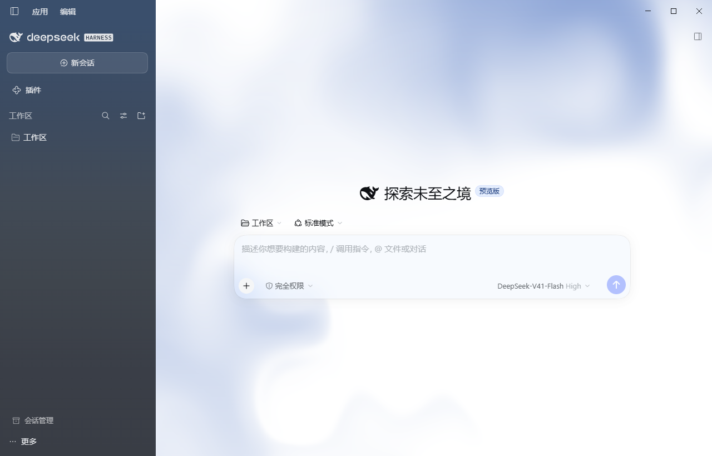
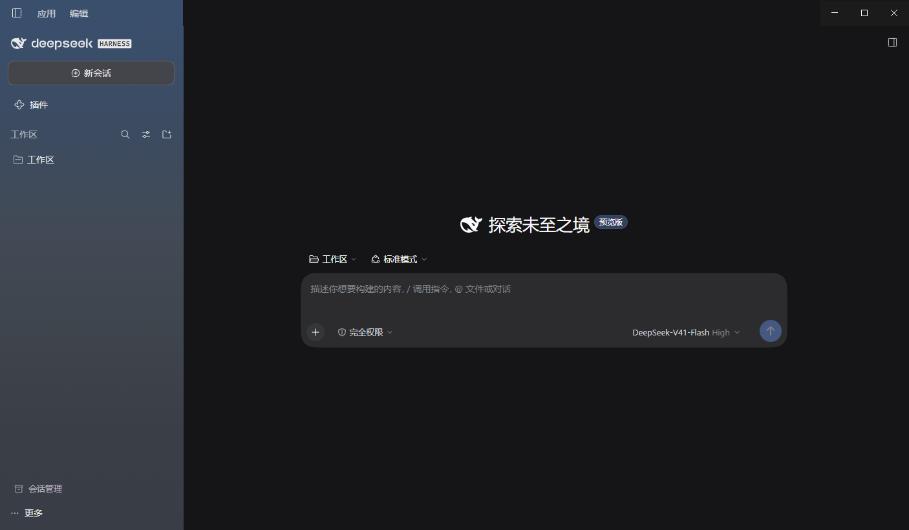
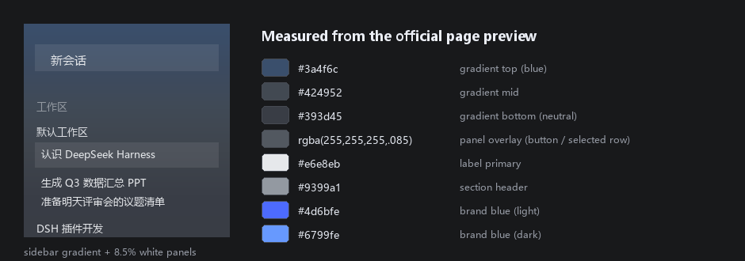

# dsh-homepage-palette-skin

> A DeepSeek Harness client skin that reproduces the official homepage preview's **deep-blue gradient glass sidebar** on Windows.
> 复刻 DeepSeek Harness 官网预览图（macOS）侧边栏的 DSH 客户端皮肤。

## 截图

同一个皮肤在两种主题下的样子 —— **左侧栏固定深蓝渐变，右侧内容区跟随浅色 / 深色**：

| 浅色模式 | 深色模式 |
| :------: | :------: |
|  |  |

下面是配色预览（按官网预览图的实测值渲染，不是截图）：



## 效果

| 区域 | 效果 |
| ---- | ---- |
| **左侧栏** | **固定深蓝渐变**（顶部蓝 → 底部中性深灰），**不跟随浅色 / 深色** |
| **右侧内容区** | 保持不透明，**正常跟随浅色 / 深色** |
| 品牌色 | 主按钮 / 品牌强调色 = 官网蓝 `#4d6bfe`（深色 `#6799fe`） |

### 可选：浅色内容配色（v1.1.0+）

**设置 → 通用 → 「浅色内容配色」**，给右侧内容区选一层低眩光底色（仅浅色模式生效）：

| 档位 | 底色 |
| ---- | ---- |
| 默认 | DSH 原生 `#ffffff` |
| **官网流动** | 复刻 deepseek.com 首页**缓慢流动的蓝色背景**（见下） |
| 雾蓝 | `#dee5ef` |

**「官网流动」** 不是纯色，也不是 CSS 画的——**直接跑官网原版着色器**：

- 官网实现是 WebGL —— `type:"pattern"` 着色器，实测配置
  `colors ["#8AA3D6","#FFFFFF","#FFFFFF"]`、`speed 14`、`swirl 12`、`distortion 20`、
  `scale .5`、`shape "checks"`、`shapeScale 10`、`offsetY 65`。
- 本插件把**着色器 GLSL 逐字提取**，并照搬官网 JS 的参数归一化
  （`offset/100`、`rotation/90`、`proportion/100`、`softness/100`、
  `shapeScale/100`、`distortion/100`、`swirl/50`、`u_time = 秒×(speed/100)`）——
  所以**颜色、速度、运动方式与官网一致**。时间换算下来约 **0.07 秒/秒**，
  一个特征横穿屏幕约 70 秒。
- **为什么不用 CSS 近似**：试过，不成立。色值对不上（不是同一套噪声场），
  速度也差了十几倍。CSS 做不出那个流体场。
- 画布挂在框架内（`z-index:-1`，画在框架背景之上、内容之下），侧边栏的不透明
  渐变正好盖住左半边，**接缝天然对齐**；向下淡出的遮罩逐字照搬。
- 只作用于浅色模式；30fps 节流、窗口隐藏自动停；系统关闭动效时只画一帧；
  没有 WebGL2 时安全退回纯色纸面。

三档着色都是 `#3a4f6c`（侧边栏顶端）的**同色相推导**，所以和左侧栏是一套材质，
不会出现"左边冷蓝、右边暖黄"的割裂。底色只改 `--dsw-alias-bg-base` 一个 token，
因此框架、内容卡片、圆角缺口会一起跟着走（缺口隐形的关系不会被破坏），
而卡片层表面仍保持白色，浮在着色底上。

偏好由宿主持久化（与 ui-theme 存明暗偏好同一机制），**重启后保留**。

因为侧边栏是深底，插件会把侧边栏子树内的**文字 / 边框 / 交互色固定成浅色**，
所以即使当前是浅色模式，侧边栏也是"深底 + 浅字"，不会深底深字读不了。

## 安装

这是一个 `dsh.client` 插件，宿主提供全部依赖，**零 npm 依赖**。

### 方式一：从 GitHub 安装（推荐）

```bash
# 在你的 dsh profile 目录下（例如 ~/.dsh/profiles/desktop）
pnpm add github:Tim5613/dsh-homepage-palette-skin
```

然后在 profile 的 `package.json` 里把包名加进 `dsh.profile.bundles`：

```json
{
  "dsh": {
    "profile": {
      "bundles": [
        "...",
        "dsh-homepage-palette-skin"
      ]
    }
  }
}
```

### 方式二：clone 到本地插件目录

```bash
git clone https://github.com/Tim5613/dsh-homepage-palette-skin.git ~/.dsh/plugins/dsh-homepage-palette-skin
```

再把它作为 `file:` 依赖装进 profile：

```bash
cd ~/.dsh/profiles/desktop
pnpm add file:~/\.dsh/plugins/dsh-homepage-palette-skin
```

（Windows 路径写成 `file:C:/Users/<Windows用户名>/.dsh/plugins/dsh-homepage-palette-skin`）

### 方式三：交给 DSH 插件管理器

用 DSH 的插件安装工具指定 `file:` 规格即可 —— 它会一并写好
`package.json`、`pnpm-lock.yaml` 与 `dsh.profile.bundles`：

```
install_bundle  target = file:C:/Users/<Windows用户名>/.dsh/plugins/dsh-homepage-palette-skin
```

> **生效方式：无需刷新、无需重启。** DSH 的客户端 bundle 是热加载的，
> 改完磁盘上的 `client.js`，运行中的界面几秒内就会用上新代码。

## 所有颜色都是量出来的

对官网预览图逐像素采样（`P = a·255 + (1−a)·B` 反解），不是肉眼估的。

### 侧边栏渐变

| y | 实测 | | y | 实测 |
| --- | --- | --- | --- | --- |
| 6 | `#3a4f6c` | | 304 | `#424952` |
| 121 | `#3c4b61` | | 425 | `#3c4149` |
| 182 | `#3f4b5b` | | 547 | `#393d45` |
| 243 | `#414a56` | | | |

**关键：饱和度向下递减 —— 顶部蓝 → 中性深灰，底部并不发紫。**

### 面板的白色叠加 alpha

| 元素 | 实测 P | 同 y 背景 B | 反解 alpha |
| ---- | ------ | ----------- | ---------- |
| 「新会话」按钮 | `#4d5b6f` | `#3d4c63` | **0.083** |
| 「选中会话」行 | `#4f5762` | `#404752` | **0.086** |

→ 参考图的面板就是 **8.5% 白**。用 10%~16% 会明显"发闷、块状、不像玻璃"。

### 文字色（区域内最亮像素）

| 元素 | 实测 |
| ---- | ---- |
| 普通条目 | `#e6e8eb` |
| 选中条目 | `#e3e6e9` |
| 分区标题「工作区」 | `#9399a1`（≈ 44% 白） |
| 底部署名 | `#f4f5f7` |

## 实现要点 / 踩过的坑

1. **这套侧边栏 DSH 自带，但被 `[data-platform=darwin]` 锁死在 macOS。**
   Windows 上 `sidebarCol` 只是一条不透明纯色 —— 怎么改颜色 token 都变不出渐变。
2. **侧边栏不是一个元素。** `.BynINW_sidebarCol` 里嵌着 ui-sidebar 的
   `SidebarRoot`，自带 `background:var(--dsw-specific-sidebar-fill)` 且
   `height:100%` —— 等于给侧边栏盖了个不透明盖子，只给列上色会被整块挡掉。
   → 把该 token 在侧边栏子树内置为 `transparent`（不依赖哈希类名）。
3. **内容卡片左上 16px 圆角缺口**会露出框架底色，白卡片角上出现一块深色"三角圆弧"。
   → 框架底色设成 `var(--dsw-alias-bg-base)`（= 卡片色），缺口隐形。
4. **自己加的顶部高光会留亮带。** `inset 0 1px 0 rgba(255,255,255,.16)` 实测在圆角处
   留下 `#6a7492` 亮带 —— 正好是"侧边栏色 `#4d597d` 与 16% 白的混合"。
5. **不能只靠 `backdrop-filter`。** 系统关闭「透明效果」时（Windows 11 的
   Transparency effects，Chromium 映射为 `prefers-reduced-transparency: reduce`），
   浏览器会连模糊一起停用。→ 渐变直接写在侧边栏上，模糊只作加分项。

## 已知边界：真正的窗口级透明

参考图的通透有一半来自 **macOS 原生窗口 vibrancy**（Electron 把窗口设为透明 +
系统材质，桌面被实时模糊后透上来）。本插件在**渲染层**改 CSS，看不到窗口外的桌面；
DSH 在 Windows 上创建窗口时也没有开启透明 —— 在 `app.asar` 的 desktop host 里
找不到 `transparent` / `vibrancy` / `backgroundMaterial` 任何一项配置。

所以本插件能做到的是**把参考图的颜色与透明度关系 1:1 复刻**；
**真正的"看见桌面"需要改客户端本体**（给 `BrowserWindow` 加
`backgroundMaterial: 'acrylic'`，Windows 11 支持）。

## 目录结构

```
├── package.json          插件清单（dsh.bundle / dsh.client 声明）
├── cordis.patch.yml      bundle 层插入条目
├── lib/
│   ├── index.js          宿主侧（空实现，仅保证 loader 条目可解析）
│   └── client.js         客户端侧：注入皮肤样式表 + 品牌蓝 token 覆盖层
├── assets/               浅色 / 深色截图
├── screenshots.json      声明截图，供市场详情页使用
├── preview.png           配色预览（按实测值渲染，非截图）
├── CHANGELOG.md
├── LICENSE
└── README.md
```

`lib/client.js` 把样式表注入 `document.head`（DSH 自身 ui-theme 的同一套做法，
随 `ctx.effect` 卸载），并用 `!important` 压过 token 样式表与 `ThemePresenter`
写在 `body` 上的内联变量；同时用 `ctx.theme.overrideTokens()` 注册品牌蓝，
让 `theme-color` 与主题快照保持一致。

> **注意**：里面的 `.BynINW_*` 是 ui-layout 的 CSS Module 哈希类名，
> 已配 `[class*="sidebarCol"]` 同族兜底；DSH 升级后若哈希变化，兜底选择器仍生效。

## 自定义

改 `lib/client.js`：

| 想改什么 | 改哪里 |
| -------- | ------ |
| 侧边栏渐变 | `SIDEBAR_BG` 的 6 个十六进制值 |
| 面板浓度 | 第 ③ 段里的 `rgba(255,255,255,.085)` |
| 文字色 | 第 ③ 段的 `--dsw-alias-label-*` |
| 品牌蓝 | 第 ⑤ 段的 `body` / `body[data-ds-dark-theme]` |

## License

[MIT](LICENSE)

---

> 本项目的配色取自 DeepSeek 官网公开页面的视觉样式，仅作个人客户端主题用途；
> 与 DeepSeek 官方无隶属关系。DeepSeek、DeepSeek Harness 为其各自所有者的商标。
